21.05.31. - 21.06.21.
 

#### Subject

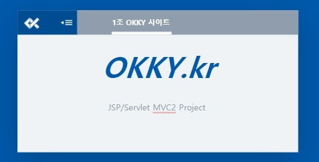

> okky.kr 사이트 클론코딩

게시판 `CRUD` 중심 `jsp` 기능 활용을 위하여 okky.kr 사이트의 클론 코딩 진행.

 

---
#### Tools

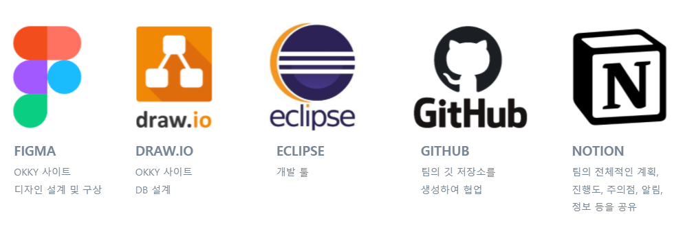

+ Bootstrap

 

---
#### Languages

jsp | java | css | html | oracle

 

---

#### Team

* 이 솔
* 성창식
* 이성욱
* 최수연

 

---

#### Design
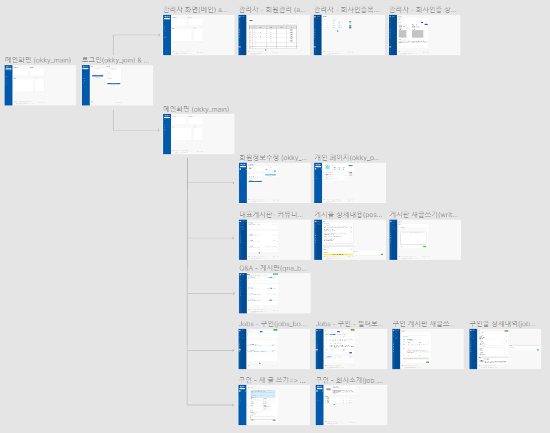
* reference : [okky.kr]
* figma : [figma] 

 

---

#### Project
* github : [okky 프로젝트]
* notion : [프로젝트 진행상황] \| [이슈] \| [메모]	

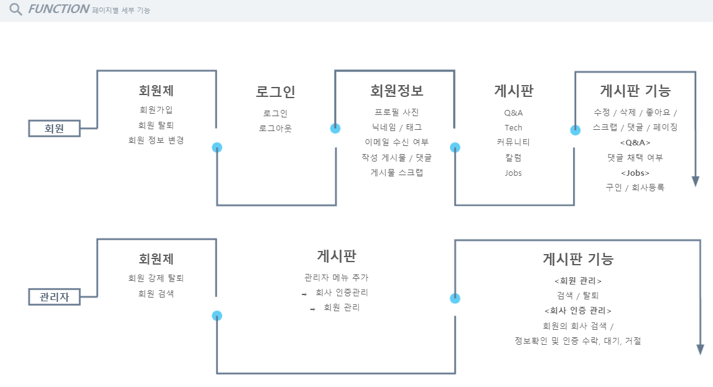

**[회원]** : 게시판에 글을 자유롭게 작성하고 읽고 수정하고 삭제할 수 있으며, 사업자의 경우 회사인증 과정을 거쳐 구인 게시판에 글을 등록할 수 있다.    
**[관리자]** : 회원을 관리하며, 부적절한 회원은 강제탈퇴시킬 수 있다. 또한 회사인증을 승인하거나 거절할 수 있으며, 회원이 작성한 모든 글을 강제로 수정, 삭제할 수 있다.

 

#### 화면 구현
반응형 웹으로 구현하여,   
웹일 때와 모바일일 때 화면 사이즈에 반응하여 가장 적합한 시각화를 이룰 수 있도록 하였다.   

- 메인 화면
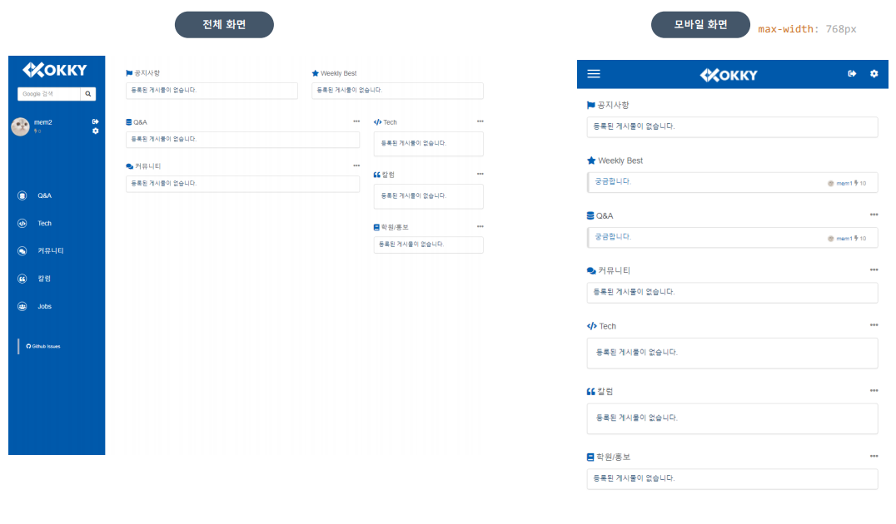

 

- 로그인/ 회원가입
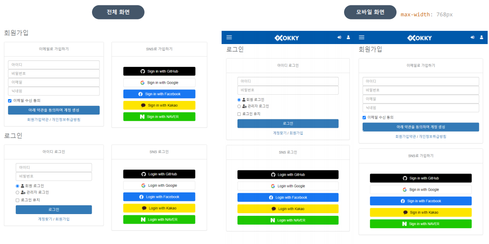

 

- 회원정보 수정
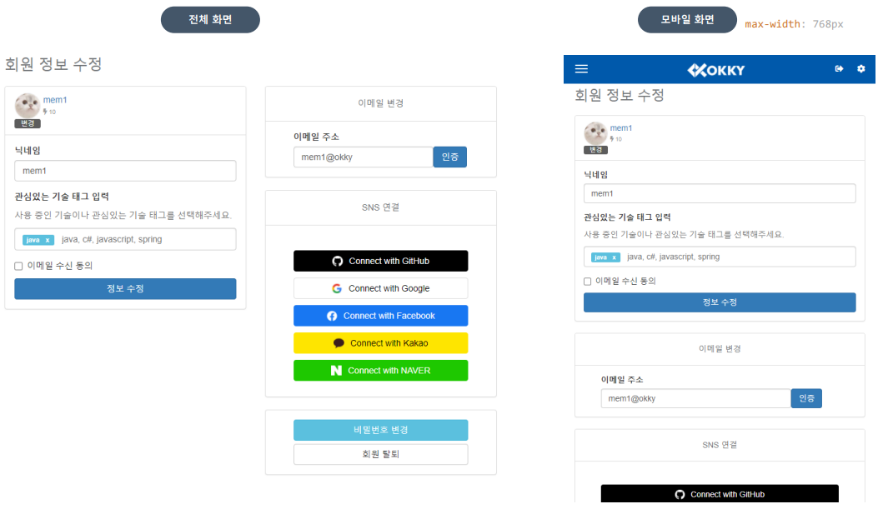

 

- Q&A 게시판
	- 로그인한 회원은 새 글을 쓸 수 있다.
	- 게시글에 달린 답변의 수와 채택 여부를 색상과 수를 통해 시각화하였다.
	- 글을 최신순, 추천순, 댓글순, 스크랩순, 조회순에 따라 재정렬할 수 있다.
	- 글을 작성한 회원의 개인 페이지를 방문할 수 있다.
	- 탈퇴한 회원의 글은 읽을 수 있으나, 개인 페이지는 방문할 수 없다.
	- 탈퇴한 회원은 이미지와 닉네임이 일괄 (익명회원)으로 처리되어 출력된다.
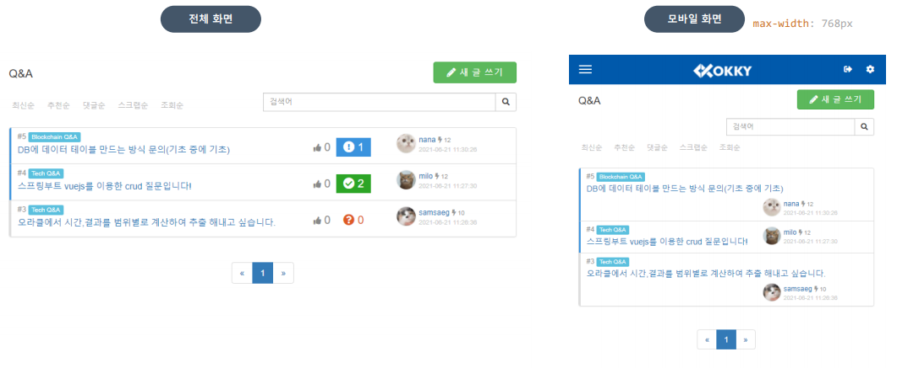

 

- Q&A 게시판 글 상세내용 및 답글
	- 글을 작성한 회원은 글을 수정하거나 삭제할 수 있다.
	- 글을 작성한 회원을 답글 중에 하나를 채택할 수 있으며, 반대로 채택한 답변을 취소할 수도 있다.
	- 글을 추천하거나 개인페이지로 스크랩할 수 있다.
	- 댓글을 추천할 수 있다.
	- 댓글을 작성할 수 있으며 댓글 작성자는 작성한 글을 수정하거나 삭제할 수 있다.
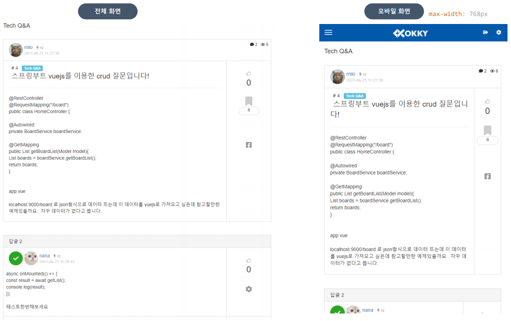

 

- 일반 게시판
	- Q&A 게시판과 마찬가지로 로그인한 회원만이 새 글을 작성할 수 있으며,  최신순, 추천순, 댓글순, 스크랩순, 조회순에 따라 글을 재정렬할 수 있다.
	- 글마다 댓글여부와 댓글 수, 추천 수, 조회 수를 색상 및 수로 확인할 수 있다.
	- 글을 작성한 회원은 글을 수정하거나 삭제할 수 있다.
	- 글을 추천하거나 개인페이지로 스크랩할 수 있다.
	- 댓글을 추천할 수 있다.
	- 댓글을 작성할 수 있으며 댓글 작성자는 작성한 글을 수정하거나 삭제할 수 있다.
	- 글을 작성한 회원의 개인 페이지를 방문할 수 있다.
	- 탈퇴한 회원의 글은 읽을 수 있으나, 개인 페이지는 방문할 수 없다.
	- 탈퇴한 회원은 이미지와 닉네임이 일괄 (익명회원)으로 처리되어 출력된다.
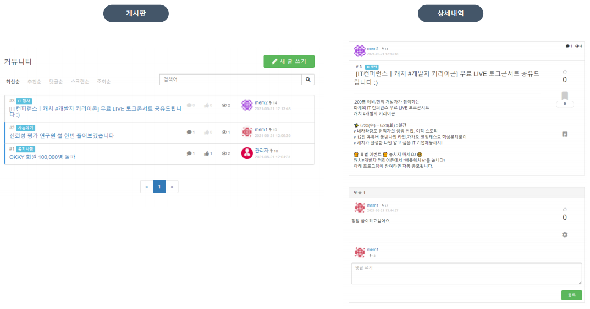

 

- 검색
	- 로그인 여부와 상관없이 사이트에 접속한 이용자는 사이트 내 게시물을 검색할 수 있다.
	- 검색한 글은 최신순에 따라 조회되며, 그외 추천순, 댓글순, 스크랩순, 조회순에 따라 재정렬할 수 있다.
	- 검색한 키워드는 검색 입력창에 남아 확인할 수 있다.
	- 검색창 옆 x버튼을 클릭하여 바로 직전 화면으로 돌아갈 수 있다.
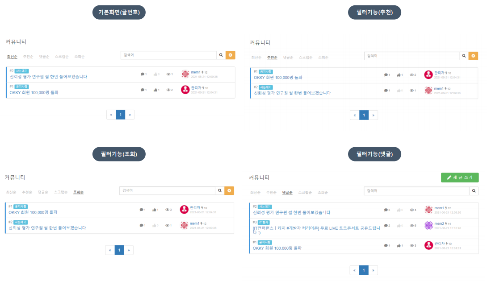

 

- 회사 등록
	- 구인 게시글을 작성하고 싶은 회원은 회사를 등록하여 인증을 기다려야 한다.
	- 회사를 등록하지 않고 구인글 작성시 자동으로 회사 인증 게시물 작성으로 이동한다.
	- 회사 인증 대기 중이면 대기중이라는 알림창과 함께 이전화면으로 이동, 회사 인증에 실패하면 실패 안내와 함께 다시 인증할 수 있도록 회사 인증 게시물 작성으로 이동한다.
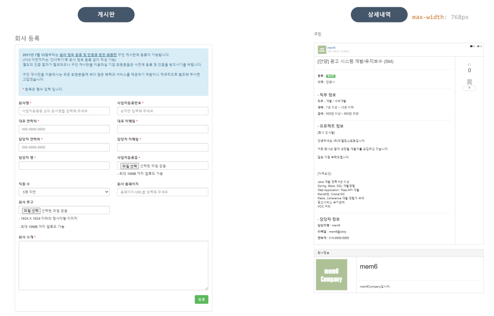
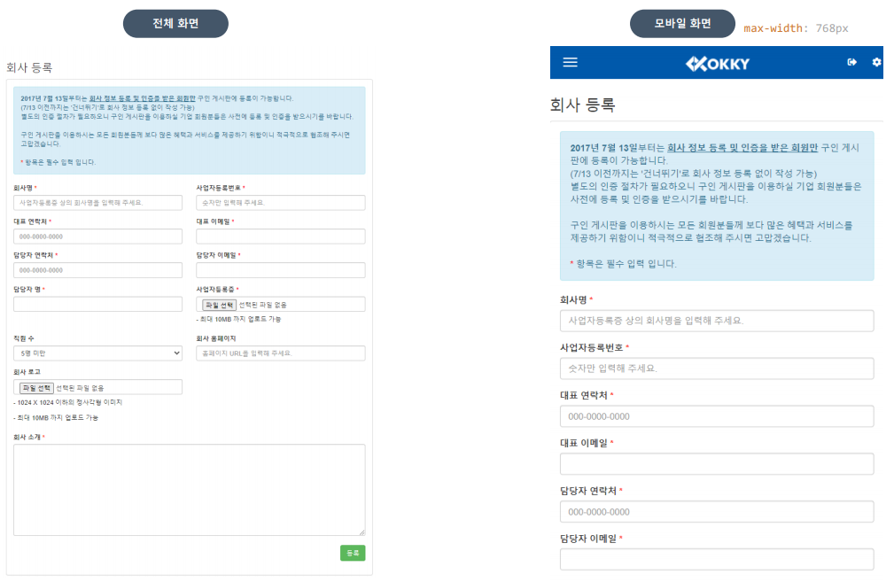

 

- 관리자 화면 : 회원 관리
	- 관리자 아이디로 로그인할 경우, 관리자 페이지 열람이 가능하다.
	- 탈퇴여부와 상관없이 가입한 회원을 모두 조회한다.
	- 탈퇴 여부를 개별 확인할 수 있으며, 개별 선택 또는 전체 선택을 통해 강제탈퇴 처리할 수 있다.
	- 회원의 아이디, 닉네임, 상태(탈퇴여부)에 따라 검색이 가능하다.
	- 회원 이미지 또는 닉네임을 클릭할 시 회원의 개인 페이지로 이동한다
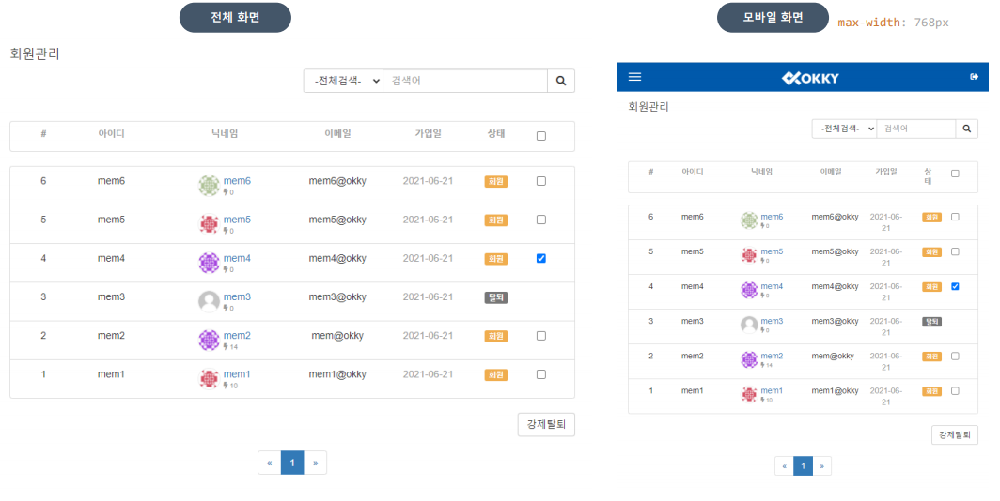

 

- 관리자 화면 : 회사인증 관리
	- 구인글을 작성하고 싶은 회원이 신청한 회사인증글을 관리할 수 있다.
	- 전체 회사 인증 신청글을 확인할 수 있으며, 우측에 대기, 승인, 거절로 상태가 표시된다.
	- 회사 이미지 또는 회사명을 클릭할 시 회사 인증 신청글의 상세내역을 확인할 수 있다.
	- 회사 인증 신청글의 상세내역에서 회사 인증 상태를 선택할 수 있다.(대기, 승인, 거절)
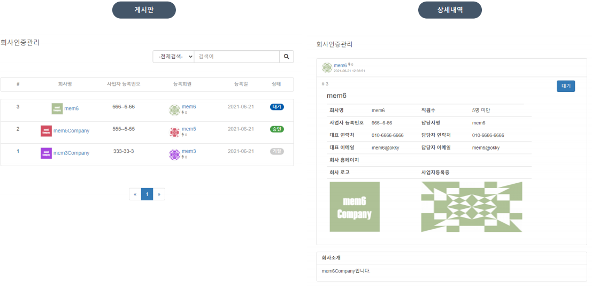

 

---

#### 마무리하며

**게시판 중심의 CRUD 구현**을 완벽하게 수행했다.  
이보다 더 게시판을 많이 만질 날이 있을까 싶을정도로 게시판 CRUD 구현에 집중했다.  

프로젝트를 진행하며 JSP, MVC2 패턴의 컨트롤러와 뷰페이지 간 연결을 충분히 익혔고, 또한 클론코딩의 기반이 된 사이트 자체가 거의 모든 곳에 부트스트랩을 사용했기 때문에 덕분에 **부트스트랩** 프레임 워크 사용법을 제대로 익힐 수 있었다. 

모바일과 웹 버전에 차이를 둔 **반응형 웹**의 시각화 공부도 재밌었다.  
특히 관리자 페이지는 공개되지 않는 페이지라, 어떤 기능이 있을지 어떤 화면으로 구성되어 있을지 상상하며 밑단부터 하나씩 퍼즐 맞추듯 채워가는 묘미가 있었다.  

이슈가 있을 때마다 고민하며 직접 해결하거나, 팀원들과 나누며 방법을 찾아가며 **팀프로젝트**의 의미도 되새길 수 있었다. 팀원들의 진행상황을 보는 것도 즐거웠다. 어떻게 구현을 했는지 하나하나 뜯어보는 재미가 있다.  

아쉬웠던 건 초반에 DB를 가볍게 다루고 시작해서 프로젝트를 진행하는 중간중간 수정해야 하는 일이 많았다. 처음부터 전반적인 사이트 설계, **DB 설계**를 철저하게 하는 것이 얼마나 중요한 지 새삼 깨달았다. 다음 프로젝트에선 이를 본받아 기본기를 더욱 철저하게 다져야지.

[okky.kr]:http://okky.kr
[figma]:https://www.figma.com/file/4zPrahuUVJw0Vx3DtVN5HK/JSP-%ED%94%84%EB%A1%9C%EC%A0%9D%ED%8A%B8-okky.kr?node-id=0%3A1
[okky 프로젝트]:https://github.com/sd02052/jspTeamProject
[프로젝트 진행상황]:https://www.notion.so/dc8e87156a57440e8c794b4c24567af4?v=32c54bac0daa4e6ba317f4283328e3da
[이슈]:https://www.notion.so/ee95cbaa912746c3b4e48a26877a8266?v=f6cf2a6cbb084ee09aede41728a1a424
[메모]:https://www.notion.so/1b1c151db9eb42c89b4df8d0790b263d?v=01bdf4d9309f4856892698e00b48a34a