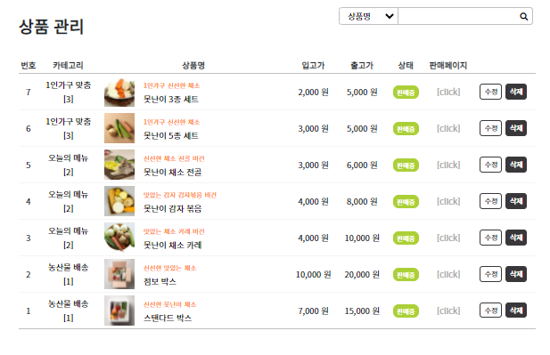

* 이미지 클릭시 원본 크기로 열람가능합니다.

#### Subject

> 농산물 구독사이트 **울퉁불퉁's**

충분히 맛있지만 흠집이 있거나 생산량이 많다는 이유만으로 버려지는 농산물을 합리적인 가격으로 판매하는 인터넷 쇼핑몰을 구독방식과 결합하여 구현.

코로나로 인해 침체된 농가에 활력을 불어넣고 일반적으로 상품가치가 없다고 여겨지는 농산품에 새로운 가치를 부여하자는 프로젝트.

  

---
#### Tools

 

---
#### Design

* brand
	- **울퉁불퉁's** : 못난이 채소의 연상이 자연스럽고 어감이 귀여운 '울퉁불퉁' + Spring project의 'S'
	- 대표 이미지 컬러 : 신선하면서도 시인성이 좋은 #FF8F1C #ABD037

* references
	- [freshshop](https://technext.github.io/freshshop/about.html) \| [ogani](https://technext.github.io/ogani/checkout.html) \| [freshugly](https://www.freshugly.com/)

 

---

#### Project
* github : [울퉁불퉁's 프로젝트](https://github.com/csooy38/SpringTeamProject)
* notion : [프로젝트 진행상황](https://url.kr/y2l6c8) \| [이슈](https://url.kr/xfab7e)

 

---
#### DataBase

- Oracle DB(RDS)
- 크게 회원/상품/결제 테이블로 나누어서 구성.
- 회원 아이디를 주 외래키로 사용하여 review, qna, like, coupon 테이블 연결, cascade delete 설정.
- 결제 테이블은 주문번호를 외래키로 사용하여 주된 주문정보(주문인, 주문정보, 쿠폰, 총액 등)와 주문된 상품정보를 연결.

 

---
#### 담당 업무

* 전체적인 프로젝트의 병합 관리(git).

* 프론트 작업
	- 상품관련 모든 페이지(상품리스트, 상품상세, 상품검색, 장바구니)와 관리자 페이지(상품등록, 수정, 삭제, 카테고리 등록 수정 삭제)를 담당. 반응형 웹까지 모두 구현.
	- 그외 팝업창 등 부분적으로 css 작업.

 

* 구현 기능
	- RESTful api 를 사용하여 SNS(네이버, 카카오)로 로그인, 회원가입 기능 구현.
	- 상품 관련 CRUD, Q&A CRUD, 카테고리 CRUD, 세션에 따른 노출여부 구현.
	- 찜하기, 장바구니 수량변경 Ajax로 실시간 DB 반영. 세션으로 로그인 회원을 조회하여 적용.
	- 상품 등록, 수정시 CKEditor 를 사용하여 이미지 편집 및 유투브 삽입 가능하도록 구현.
	- 비회원인 경우 일부 기능(찜하기, Q&A작성 등) 사용시 팝업창으로 로그인 유도.
	- 그외 마이페이지 주문내역, daum 지도 api를 사용한 주소 등록, 관리자 회원 관리 등의 기능구현에 기여.

 

---
#### View
최대 1200px, 768px, 576px 3가지 뷰포트를 나누어서 반응형 적용. 

- <b>반응형 - 태블릿 PC (max-width: 768px)</b>

 

- <b>반응형 - 모바일 (max-width: 576px)</b>

 

- <b>Main</b>

 

- <b>Login & Join</b>
	- 네이버/카카오로 로그인 가능
	- daum api로 주소 조회

 
 

- <b>About</b>

 

- <b>Product List</b>
	- 상품별 찜하기 기능

 

- <b>Product Detail</b>

 

- <b>Product Detail - review</b>

 

- <b>Product Detail - Q&A</b>

 

 
 

- <b>Cart</b>

 

- <b>Purchase</b>
	- 카카오페이로 결제

 

- <b>Search List</b>
	- 상단바 또는 태그 클릭으로 검색

 

- <b>My Page</b>

 

- <b>Admin Page - member list</b>

 

- <b>Admin Page - product list</b>

 

- <b>Admin Page - product create</b>

 

- <b>Admin Page - product update</b>

 

- <b>Admin Page - category</b>

 

 

 
